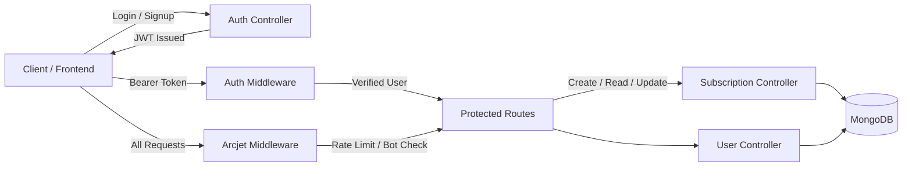

# SubSphere 🔔  
**Subscription Management & Intelligent Reminder Platform**

<p align="left">
  
  
  
  
  
</p>


## 📌 Overview
**SubSphere** is a backend-first, production-grade **subscription tracking and lifecycle management system** designed to help users centrally manage recurring subscriptions, monitor renewal cycles, and proactively avoid unwanted charges.

The platform emphasizes **secure authentication**, **robust authorization**, **scalable data modeling**, and **defensive middleware design**, aligning with real-world SaaS backend standards.  
SubSphere is architected as an **API-first system**, with frontend development intentionally decoupled to enable future extensibility and open-source collaboration.


## 🎯 Key Objectives
- Centralize management of all user subscriptions
- Track billing cycles, renewal dates, and subscription status
- Provide secure, role-aware access control
- Protect APIs using rate-limiting and bot detection
- Serve as a scalable foundation for reminders, analytics, and notifications


## 🧠 How It Works (High-Level Flow)
1. Users authenticate using JWT-based authentication
2. Authenticated users create and manage subscription records
3. Each subscription is securely mapped to its owner
4. Middleware layers enforce authentication, authorization, and rate limits
5. APIs respond with structured, predictable JSON contracts
6. Future schedulers/notifications can consume the same data layer


## 🧩 System Workflow Diagram

> The diagram below represents the end-to-end backend workflow of SubSphere, highlighting authentication, protected routes, data persistence, and security enforcement.

<!-- WORKFLOW DIAGRAM PLACEHOLDER -->



## ✅ Verified Functional Behavior

The following behaviors were validated during local and API testing:

- JWT tokens are issued and verified correctly
- Unauthorized access to protected routes is blocked
- Users can only access their own subscriptions
- Rate-limited requests are rejected gracefully
- Bot-like traffic is automatically denied

✔️ Confirms correct authentication and authorization flow  
✔️ Confirms secure ownership-based data access  
✔️ Confirms middleware-driven API protection  


## 🧩 Tech Stack

### Backend
- Node.js
- Express.js
- MongoDB (Mongoose ODM)
- JWT Authentication
- Arcjet (Rate Limiting & Bot Protection)

### Frontend
- 🚧 Not implemented (API-first architecture)


## 📂 Project Structure
```
SubSphere/
├── config/
│   ├── env.js
│   ├── arcjet.js
├── controllers/
│   ├── auth.controller.js
│   ├── user.controller.js
│   └── subscription.controller.js
├── middlewares/
│   ├── auth.middleware.js
│   ├── arcjet.middleware.js
│   └── error.middleware.js
├── models/
│   ├── user.model.js
│   └── subscription.model.js
├── routes/
│   ├── auth.routes.js
│   ├── user.routes.js
│   └── subscription.routes.js
├── app.js
├── package.json
├── package-lock.json
└── .gitignore
```


## ⚙️ Installation & Local Setup

### Prerequisites
- Node.js (v18+)
- MongoDB (local or Atlas)

### Steps
```
git clone https://github.com/<your-username>/SubSphere.git
cd SubSphere
npm install
npm run dev
```

### Environment Variables
- Create a `.env` file:

```
PORT=5000
MONGO_URI=your_mongodb_connection_string
JWT_SECRET=your_jwt_secret
ARCJET_KEY=your_arcjet_key
```

### API Base URL
```
http://localhost:5000/api/v1
```


## 🔒 System Characteristics

- Stateless REST APIs
- JWT-based authentication
- Ownership-based authorization
- Centralized error handling
- Rate-limited and bot-protected endpoints
- Clean separation of concerns


## 🚧 Known Limitations

- No frontend UI (by design)
- No background jobs for reminders yet
- No payment provider integration


## 🛣️ Future Enhancements

- Email & push notification reminders
- Subscription analytics dashboard
- Cron-based renewal alerts
- Payment gateway integrations
- Dockerized deployment
- Full-stack frontend (Open Source Ready)


## 🤝 Contribution

Contributions are welcome and encouraged.  
This project is open-source friendly and ideal for:

- Backend contributors
- Frontend developers looking to build a real UI
- Beginners entering structured open-source development


## 📄 License

This project is licensed under the **MIT License**.


## 👤 Author

**Samrat Saha**  
Backend & Full-Stack Developer
