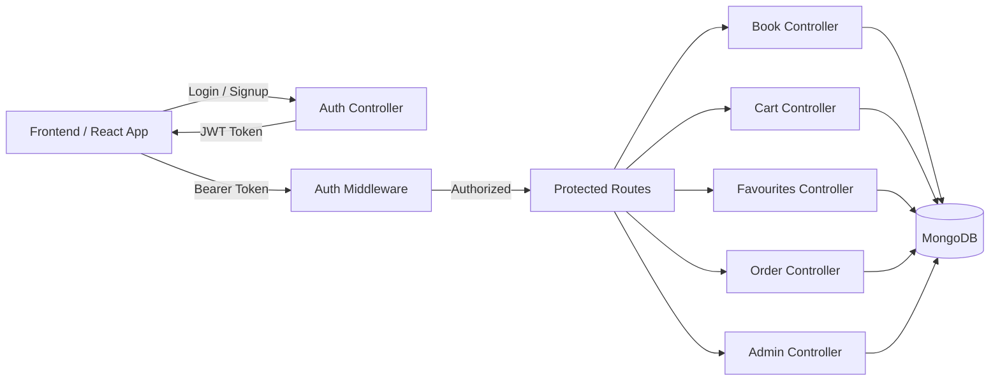

# VidyaArk 📚

## E-Commerce Bookstore Platform with e-book PDF free to Download 


## 📌 Overview

VidyaArk is a full-stack bookstore e-commerce application designed to manage book discovery, purchasing workflows, and administrative operations through a secure, scalable REST API architecture.

The system supports user authentication, cart and order management, favourites (wishlist), and an admin panel for complete book lifecycle control.  
VidyaArk is built with a backend-first mindset, ensuring data integrity, role-based access control, and clean frontend–backend separation.


## 🎯 Key Objectives

- Build a secure bookstore e-commerce backend  
- Implement JWT-based authentication and authorization  
- Enable cart, favourites, and order workflows  
- Provide admin-only book and order management  
- Design REST APIs suitable for real-world scaling  


## 🧠 How It Works (High-Level Flow)

- Users authenticate using JWT-based login  
- Authenticated users browse and interact with books  
- Cart, favourites, and orders are securely user-scoped  
- Admin users manage books and view sales analytics  
- Frontend communicates exclusively via protected REST APIs  
- MongoDB persists all user, book, and order data  


## 🏗️ System Workflow Diagram

The diagram below illustrates the complete VidyaArk workflow, covering authentication, protected routes, business logic, and data persistence.


## 👤 User Capabilities

- Register and authenticate securely  
- Browse and view book details  
- Add/remove books from cart  
- Add/remove books from favourites  
- Place orders and view order history  
- Update profile details and avatar  


## 🛠️ Admin Capabilities

- Add, update, and delete books  
- View all orders across users  
- Access admin dashboard metrics:
  - Total orders  
  - Total sales  
  - Top-selling books  
- Role-based route protection  


## 🔐 Authentication & Authorization

- JWT issued on successful login  
- Tokens sent as `Bearer` Authorization headers  
- Middleware validates:
  - Token integrity  
  - User identity  
  - User role (user / admin)  
- Unauthorized access is blocked at middleware level  


## 🧩 Backend Design Overview

### Express Router Layer
- Modular route separation for users, books, cart, favourites, and orders  

### Middleware Layer
- Authentication, authorization, validation, and error handling  

### Controller Layer
- Business logic and request orchestration  

### Database Layer
- MongoDB with Mongoose schemas for structured relations  

This layered approach ensures maintainability, testability, and scalability.


## 🌐 Frontend–Backend Integration

- React frontend consumes REST APIs via Axios  
- Centralized API configuration  
- JWT-aware requests for protected endpoints  
- UI state driven by API responses  
- Frontend remains loosely coupled to backend contracts  


## 🧩 Tech Stack

### Backend
- Node.js  
- Express.js  
- MongoDB (Mongoose)  
- JWT Authentication  
- RESTful API Design  

### Frontend
- React  
- Redux Toolkit  
- Axios  
- Tailwind CSS  

## 📂 Project Structure

```
VidyaArk/
├── backend/
│   ├── connection/
│   ├── controllers/
│   ├── middlewares/
│   ├── models/
│   ├── routes/
│   ├── uploads/
│   └── app.js
├── frontend/
│   ├── src/
│   │   ├── api/
│   │   ├── components/
│   │   ├── pages/
│   │   ├── store/
│   │   └── App.jsx
├── package.json
└── README.md
```

## ⚙️ Installation & Local Setup
###Prerequisites

-Node.js (v18+)
-MongoDB (local or Atlas)

### Steps
```
git clone https://github.com/<your-username>/VidyaArk.git
cd VidyaArk
npm install
npm run dev
```

### Environment Variables
```
PORT=5600
MONGO_URI=your_mongodb_connection_string
JWT_SECRET=your_jwt_secret
```

## 🚧 Known Limitations

- Payment gateway not yet integrated

- No real-time notifications

- Basic analytics only (can be extended)

## 🛣️ Future Enhancements

- Payment gateway integration

- Advanced search and filtering

- Recommendation engine

- Email notifications

- Admin analytics expansion

- Cloud storage for media

## 📄 License

- This project is licensed under the MIT License.

## 👤 Author

Samrat Saha
Backend & Full-Stack Developer
